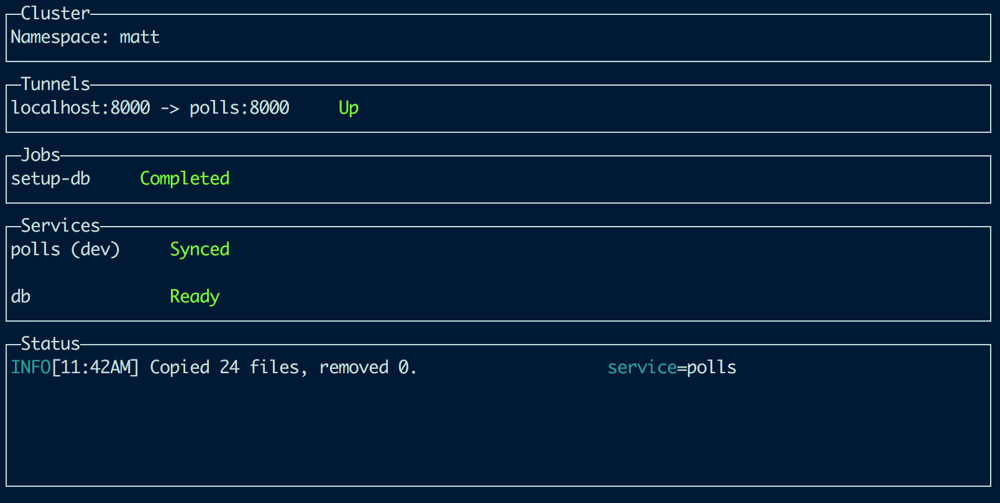
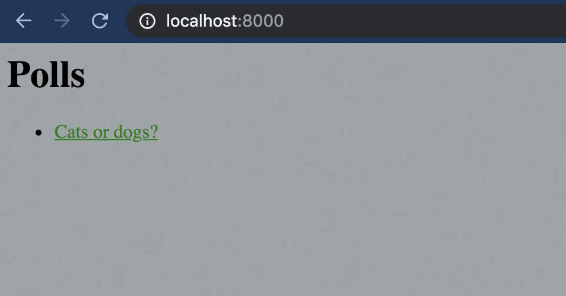
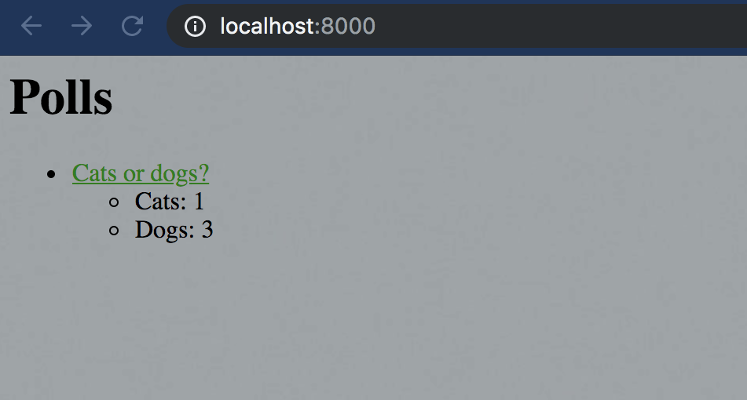

# Python (Polls) Example App

**Estimated Time**: 10 minutes 
**Dependencies**: None

??? tip "Although you normally need [your own cluster](../../deployment) to use Kelda, this guide uses a precreated [Hosted Kelda](/request-hosted-kelda-access) cluster so that you can dive right in to the example app."

In this guide we will deploy the Polls Python application, observe Kelda syncing
an update to our code, and take a look at the application's Kelda config files.
If you're trying to use Kelda with a Python app, we recommend that you start
with this doc.

## **Setup**

1. **[Install the Kelda CLI](../../installing-cli)**

    Run the following command to download and install Kelda.

        curl -fsSL 'https://kelda.io/install.sh' | sh

1. **Download the [Kelda examples repository](https://github.com/kelda-inc/examples)**

    This repository contains the source code and Kelda config for Polls.

        git clone https://github.com/kelda-inc/examples

1. **Configure Kelda to work on the Polls project**

    The following command creates a file that's required for the `kelda`
    commands to work.

    Most users can just use the defaults by hitting [Enter] for each prompt.

    In the root directory of the examples repository, run:

        ./django-polls/configure-kelda.sh --use-demo-cluster

    If the command succeeded, you should see something like:

        Wrote config to /Users/kevin/.kelda.yaml

    ??? tip "Kelda maintains a public cluster for demos. If you've already [setup a Kelda cluster](../../deployment), just omit the `--use-demo-cluster` flag."

## **Developing with Kelda**

1. **Start development on the Polls service**

    Run the following command from the examples repo. It will boot the Polls
    service and its dependencies, start the code syncing, and start the tunnel
    to the app's frontend.

        kelda dev ./django-polls/src

    Wait for all of the services to become `Ready`. The first boot may take
    several minutes while all the services boot.

    

1. **View the Poll frontend**

	Open [http://localhost:8000](http://localhost:8000) in your browser, click
    the "Cats or dogs?" link, then cast your vote.

    

1. **Modify the service code to show the poll results**

	Edit `django-polls/src/polls/templates/polls/index.html` to delete the
    comment elements on lines 13 and 19.  Save the changes.  Kelda will sync
    the change into your development environment and and restart the Django server.

1. **View the change in your browser**

    Reload [http://localhost:8000](http://localhost:8000). You will see the
    results of the poll now.  Cast a few more votes to guarantee victory for your side.

    

## **Cleanup**

1. **Exit Kelda**

    Exit Kelda by entering `Ctrl + c` into the terminal window where the Kelda
    CLI is running.

1. **Delete your development namespace**

    Run `kelda delete` to delete your development namespace so that it stops
    consuming resources in the remote cluster.

## **Deep Dive into the Kelda Configuration**

Let's take a closer look at this project's Kelda configuration files to better
understand what Kelda is doing under the hood.

**Workspace Configuration**

First, take a look at the
[workspace.yaml](https://github.com/kelda-inc/examples/blob/master/django-polls/kelda-workspace/workspace.yaml)
file.  Every Kelda project requires this Workspace config file.  It defines the
services that will be deployed into Kubernetes.

The Polls app has three services: `polls`, `db`, and `setup-db`. The [Kubernetes YAML
](https://kubernetes.io/docs/tasks/manage-kubernetes-objects/declarative-config/)
for the services are stored in the same directory as the `workspace.yaml` file.

Service | Purpose
--- | ---
`polls` | This service deploys a Python Docker container and runs the Django server on port 8000.
`db` | This service deploys and configures a Postgres database container.  The Polls Django application stores the polls and votes in this database.
`setup-db` | This service is a Kubernetes job (as opposed to the previous deployments) so it runs a single time then stops.  It contains an [init container](https://kubernetes.io/docs/concepts/workloads/pods/init-containers/), which in this case waits until Postgres is fully deployed, before initializing the database and importing data.

In the Kelda CLI window you will see each of these services and their
status.  `setup-db` becomes `Completed` when the job finishes running, `polls`
becomes `Synced` when the initial sync finishes, and `db` becomes `Ready` when
the database is ready to accept connections.

The `tunnels` section of the `workspace.yaml` file sets up the HTTP tunnel to the cluster.
It tunnels port 8000 on `localhost` to port 8000 in the `polls` service.
This lets you easily and privately access the app on the cluster.

Please see
our [guide on writing the Workspace configuration](../../configuring-kelda/workspace/overview/)
for more information.

**Sync Configuration**

Another required Kelda file is
[kelda.yaml](https://github.com/kelda-inc/examples/blob/master/django-polls/src/kelda.yaml).
This is the Sync configuration for
the project.  It starts the Django server, performs an initial sync based
on the defined rules, then resyncs files as they are changed.

Line(s) | Field | Purpose
-|-|-
1|version|The Kelda config format version.
2|name|The name of the service that Kelda is syncing to.  It must match a service in the output of `kelda dev --no-sync`.
3|image|The Docker image used by the cluster, `python:3` in this case.
4|command|The commands that are run after each sync.  For the Polls app, the command starts the Django server.  The `--noreload` switch isn't necessary but is used in this instance since Kelda already kills and reruns the command after each sync.
5|initCommand|The commands that are run after a sync on any rule with `triggerInit` set to true.  The `requirements.txt` file relies on this, as it contains [dependencies](https://kubernetes.io/blog/2019/07/23/get-started-with-kubernetes-using-python/).  If this file is changed, it runs `initCommand` which installs those dependencies using `pip`.
6-11|sync|The local and remote paths of files to sync.

Please see
[our guide on writing the Sync configuration](../../configuring-kelda/sync/overview/)
for more information.
