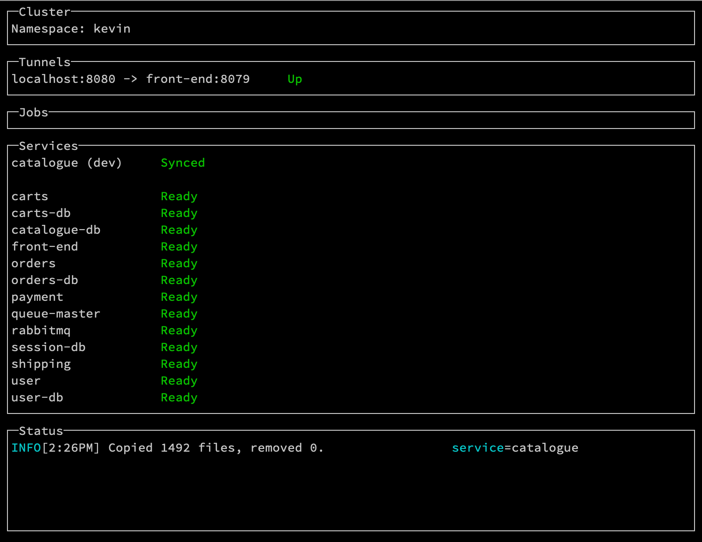
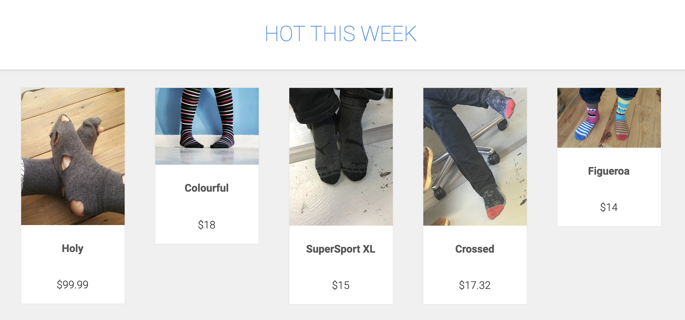
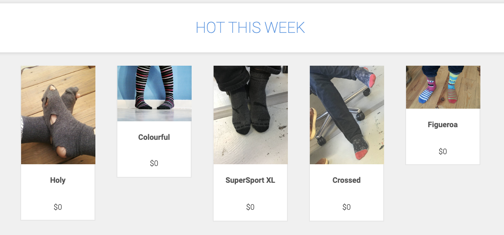
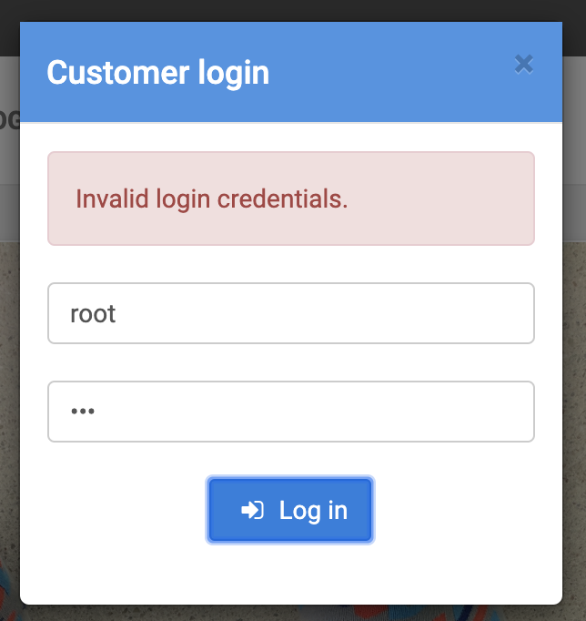
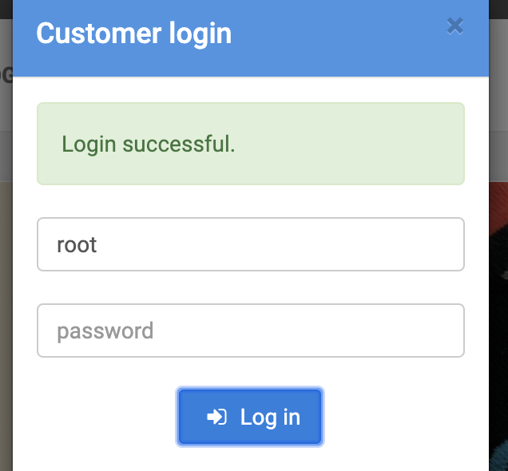

# Golang (Sock Shop) Example App

**Estimated Time**: 10 minutes 
**Dependencies**: The [Go CLI](https://golang.org/doc/install)

??? tip "Although you normally need [your own cluster](../../deployment) to use Kelda, this guide uses a precreated [Hosted Kelda](/request-hosted-kelda-access) cluster so that you can dive right in to the example app."

In this guide, we'll deploy the Sock Shop demo application, and see what it's
like to develop Go code with Kelda.

## Setup

1. **[Install the Kelda CLI](../../installing-cli)**

    Run the following command to download and install Kelda.

        curl -fsSL 'https://kelda.io/install.sh' | sh

1. **Download the [Kelda examples repository](https://github.com/kelda-inc/examples)**

    ??? warning "The repo must be downloaded into your GOPATH or else the code won't build."

    This repository contains a script that we'll use to connect to the demo
    cluster, as well as the source code and Kelda config for Sock Shop.

        go get github.com/kelda-inc/examples

    The command will produce the error `no Go files`, but that's expected
    because the Go code is in a subdirectory.

1. **Configure Kelda to work on the Sock Shop project**

    The following command creates a file in your home directory that's required
    for the `kelda` commands to work.

    Most users can just use the defaults by hitting [Enter] for each prompt.

    In the root directory of the examples repository, run:

        ./golang-sock-shop/configure-kelda.sh --use-demo-cluster

    If the command succeeded, you should see something like:

        Wrote config to /Users/kevin/.kelda.yaml

    ??? tip "Kelda maintains a public cluster for demos. If you've already [setup a Kelda cluster](../../deployment), just omit the `--use-demo-cluster` flag."

1. **Start development on the `catalogue` service**

    Run the following command from the examples repo. It will boot the
    `catalogue` service and its dependencies, start the code syncing, and start
    the tunnel to the Sock Shop frontend.

        kelda dev ./golang-sock-shop/catalogue

    Wait for of all the services to become `Ready`. The first boot may take
    several minutes while all the services boot.

    {:height="450px"}

1. **View the Sock Shop frontend**

    Open [http://localhost:8080](http://localhost:8080) in your browser.
    There should be various socks with prices at the bottom of the page.

    

1. **Modify the service code to make all the socks free**

    Line 71 in `golang-sock-shop/catalogue/service.go` implements the `List`
    method, which returns all the socks to the frontend.

    Uncomment the code at line 105 that sets the price to always be zero.

        socks[i].Price = 0

    Once you've made the change, save the file. Kelda will sync the change into
    your development environment, and automatically rebuild and restart the
    process.

    ??? question "Curious how the syncing works?"

        Each service that you want to develop must have a
        [kelda.yaml](https://github.com/kelda-inc/examples/tree/master/golang-sock-shop/catalogue/kelda.yaml)
        that describes what files to sync, and what Kelda should do after each sync.

        For the `catalogue` service, Kelda will sync all files in the repo, and
        recompile and run the code after each sync.

1. **View the change in your browser**

    Reload [http://localhost:8080](http://localhost:8080). The socks on the
    front page should now all have a price of $0.00.

    

??? note "Alternative Syncing Approach For Large Projects"

    If your project has too many source files for Kelda to monitor for changes,
    you can cross-compile your application locally, and sync the executable over.

    The
    [user](https://github.com/kelda-inc/examples/tree/master/golang-sock-shop/user/kelda.yaml)
    service has an example of this approach.

    1. **`cd` into the directory for the `user` code**

            cd golang-sock-shop/user

    1. **Build the executable that will be run**

        Run the following command to build a `user` executable that will be
        synced by Kelda.

            ./rebuild.sh

        The script should output something like

            Building binary with 'CGO_ENABLED=0 GOOS=linux go build -o user .'
            Done. Kelda should automatically sync the 'user' file over now.

    1. **Start development on the `users` service**

            kelda dev

    1. **Try out the current login process**

        Open the Sock Shop home page at [http://localhost:8080](http://localhost:8080).

        Try logging in as the user `root` with any random password.

        {:height="300px"}

    1. **Add a backdoor to the login page**

        Uncomment the code at line 50 of `api/service.go` so that the password
        is ignored for the `root` user.

                if username == "root" {
                    return users.New(), nil
                }

    1. **Rebuild the service locally**

        Run `./rebuild.sh` to build a new version of the `user` executable.

        Once the executable is built, Kelda will automatically notice the
        change, sync the file over, and restart the process.

    1. **Test the new code**

        Try logging in as the `root` user again. It should succeed this time.

        {:height="300px"}

## **Cleanup**

1. **Exit Kelda**

    Exit Kelda by entering `Ctrl + c` into the terminal window where the Kelda
    CLI is running.

1. **Delete your development namespace**

    Run `kelda delete` to delete your development namespace so that it stops
    consuming resources in the remote cluster.
