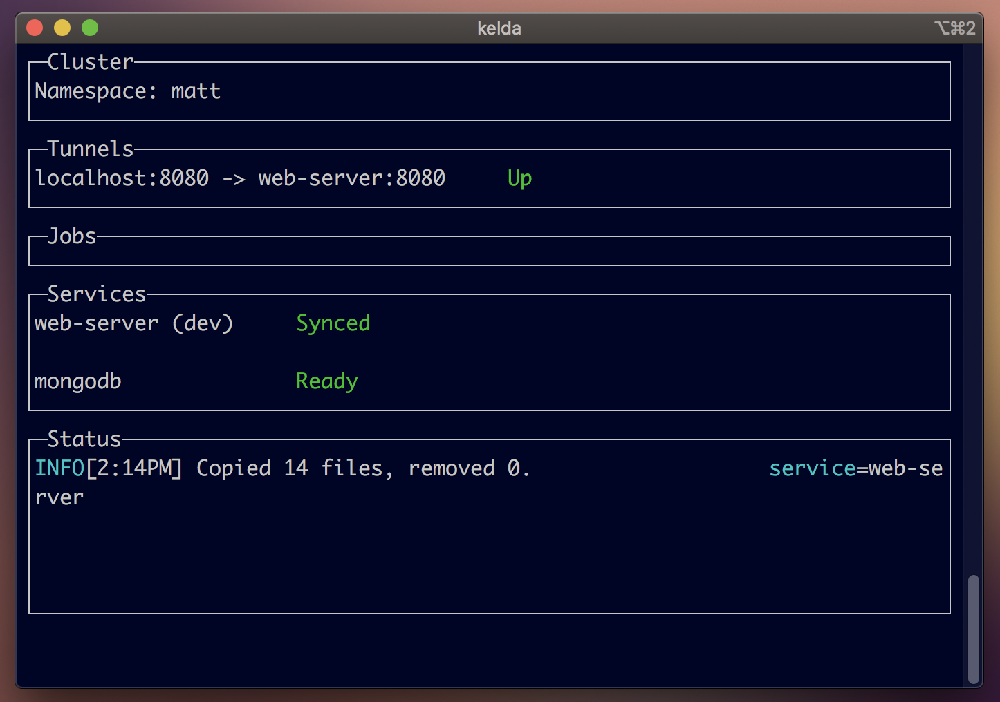
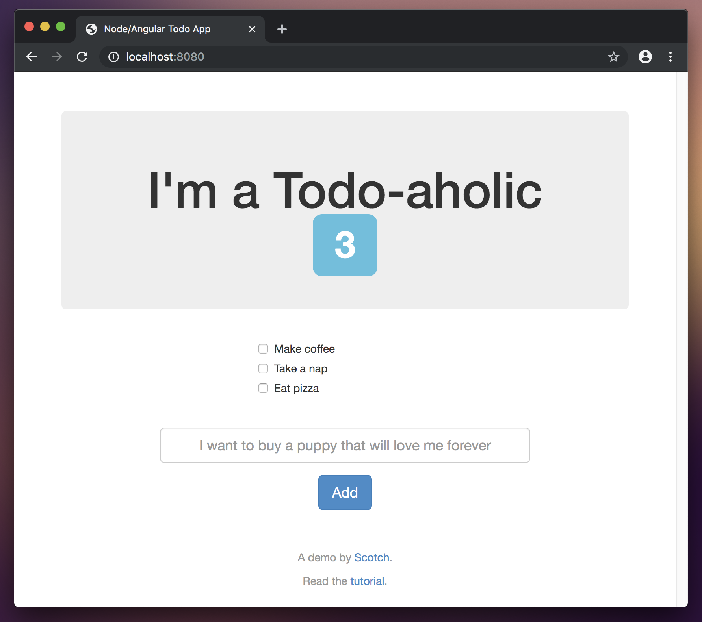
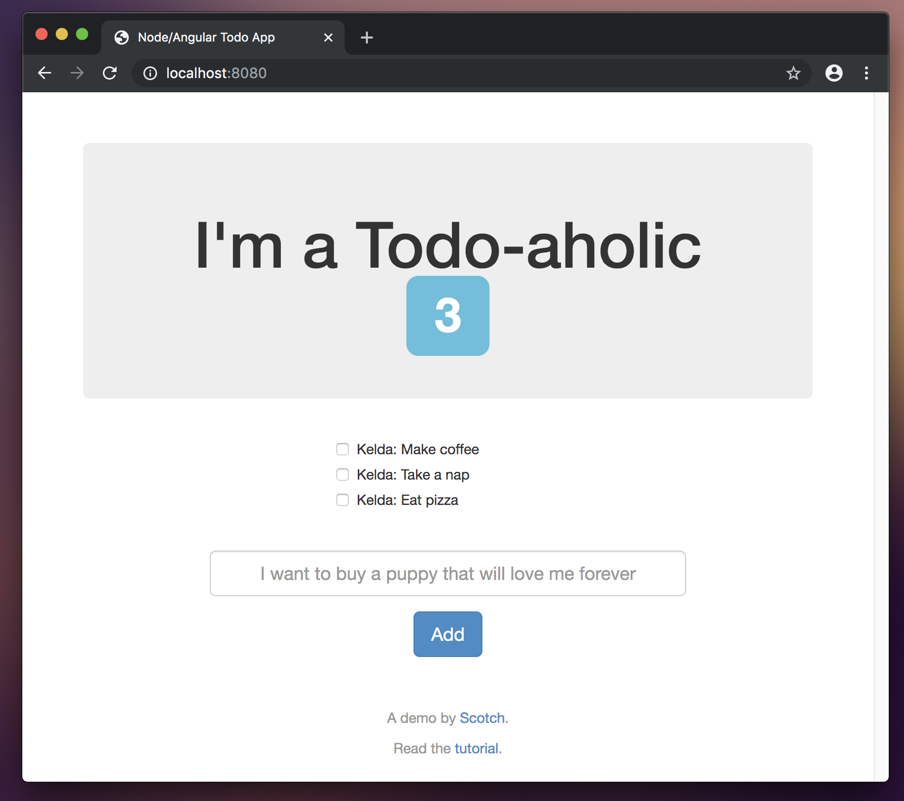

# Todo Manager (Node) Example App

**Estimated Time**: 10 minutes 
**Dependencies**: None

??? tip "Although you normally need [your own cluster](../../deployment) to use Kelda, this guide uses a precreated [Hosted Kelda](/request-hosted-kelda-access) cluster so that you can dive right in to the example app."

In this guide we will deploy the Node Todo Manager application and observe Kelda
syncing an update to our code.

## **Setup**

1. **[Install the Kelda CLI](../../installing-cli)**

    Run the following command to download and install Kelda.

        curl -fsSL 'https://kelda.io/install.sh' | sh

1. **Download the [Kelda examples repository](https://github.com/kelda-inc/examples)**

    This repository contains the source code and Kelda config for the Todo Manager.

        git clone https://github.com/kelda-inc/examples

1. **Configure Kelda to work on the Todo Manager project**

    The following command creates a file that's required for the `kelda`
    commands to work.

    Most users can just use the defaults by hitting [Enter] for each prompt.

    In the root directory of the examples repository, run:

        ./node-todo/configure-kelda.sh --use-demo-cluster

    If the command succeeded, you should see something like:

        Wrote config to /Users/kevin/.kelda.yaml

    ??? tip "Kelda maintains a public cluster for demos. If you've already [setup a Kelda cluster](../../deployment), just omit the `--use-demo-cluster` flag."

## **Developing with Kelda**

Each service that you want to develop must have a
[kelda.yaml](https://github.com/kelda-inc/examples/blob/master/node-todo/web-server/kelda.yaml)
that describes what files to sync, and what Kelda should do after each sync.

1. **Start development on the Todo service**

    Run the following command from the examples repo. It will boot the Todo
    Manager service and its dependencies, start the code syncing, and start the tunnel
    to the app's frontend.

        kelda dev ./node-todo/web-server

    Wait for all of the services to become `Ready`. The first boot may take
    several minutes while all the services boot.

    

1. **View the Todo frontend**

    Open [http://localhost:8080](http://localhost:8080) in your browser and add
    some new items to your todo list.

    

1. **Modify the service code**

    Open `./node-todo/web-server/app/routes.js` in your preferred text editor,
    uncomment the code on line 12, and save the file. Kelda will sync the change
    into your development environment and restart the Node server.

1. **View the change in your browser**

    Reload [http://localhost:8080](http://localhost:8080), you will now see
    each todo prepended with "Kelda:"

    

## **Cleanup**

1. **Exit Kelda**

    Exit Kelda by entering `Ctrl + c` into the terminal window where the Kelda
    CLI is running.

1. **Delete your development namespace**

    Run `kelda delete` to delete your development namespace so that it stops
    consuming resources in the remote cluster.

## **Deep Dive into the Kelda Configuration**

Let's take a closer look at this project's Kelda configuration files to better
understand what Kelda is doing under the hood.

**Workspace Configuration**

First, take a look at the
[workspace.yaml](https://github.com/kelda-inc/examples/blob/master/node-todo/kelda-workspace/workspace.yaml)
file.  Every Kelda project requires this Workspace config file.  It, along with
the [Kubernetes YAML files
](https://kubernetes.io/docs/tasks/manage-kubernetes-objects/declarative-config/)
in the same
[directory](https://github.com/kelda-inc/examples/tree/master/node-todo/kelda-workspace),
defines the services that will be deployed into Kubernetes.

The Todo app has two services: `web-server` and `mongodb`.

Service | Purpose
--- | ---
`web-server` | This service deploys a [Docker container](https://hub.docker.com/r/keldaio/node-todo) which runs a Node web server on port 8080.  One of the [YAML files for the service](https://github.com/kelda-inc/examples/blob/master/node-todo/kelda-workspace/web-server-dep.yaml) contains an [init container](https://kubernetes.io/docs/concepts/workloads/pods/init-containers/), which waits until the database service is live before deploying the web server.
`mongodb` | This service deploys the MongoDB container that stores the todo items.

In the Kelda CLI window you will see each of these services and their status.
`web-server` becomes `Synced` when the initial sync finishes and `mongodb`
becomes `Ready` when the database is ready to accept connections.

The `tunnels` section of the `workspace.yaml` file sets up the HTTP tunnel to
the cluster.  It tunnels port 8080 on `localhost` to port 8080 in the `web-server`
service.  This lets you easily and privately access the app on the cluster.

Please see our
[guide on writing the Workspace configuration](../../configuring-kelda/workspace/overview/)
for more information.

**Sync Configuration**

Another required Kelda file is
[kelda.yaml](https://github.com/kelda-inc/examples/blob/master/node-todo/web-server/kelda.yaml).
This is the sync configuration for
the project.  It starts the Node server, performs an initial sync based
on the defined rules, then resyncs files as they are changed.

Line(s) | Field | Purpose
-|-|-
2|version|The Kelda config format version.
5|name|The name of the service that Kelda is syncing to.  It must match a service in the output of `kelda dev --no-sync`.
8|command|The commands that are run after each sync.  For the Todo app, the command starts the Node server.
12|initCommand|The commands that are run after a sync on any rule with `triggerInit` set to true.
14-28|sync|The local and remote paths of files to sync. The first section syncs [`package-lock.json`](https://github.com/kelda-inc/examples/blob/master/node-todo/web-server/package-lock.json) and has `initCommand` set to true.  As this file defines dependencies, if it is changed Kelda runs the `initCommand` which installs those dependencies using `npm`.

Please see
[our guide on writing the Sync configuration](../../configuring-kelda/sync/overview/)
for more information.
