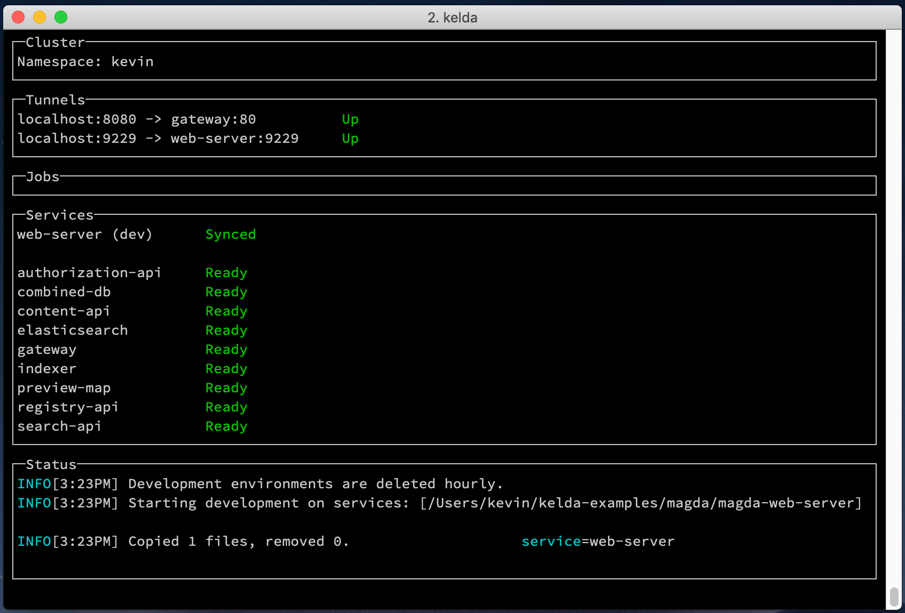
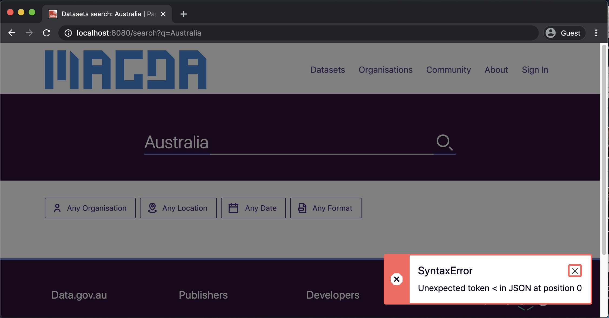

# Step By Step

## **Fixing a Bug**

1. **Wait for your services to be ready**

    !!! warning "The `kelda dev` process should not be killed during development."

        It's needed to sync local changes, and to keep the tunnels open.

        If you accidentally kill it, you can restart it by re-running the `kelda dev --demo` command.

    

    Wait for all the services to become `Ready`. The first boot may take several
    minutes because the Docker images need to be pulled.

1. **View the Bug**

    

    Open [http://localhost:8080](http://localhost:8080) in your browser. You should
    see a website with a search box.

    Try searching for "Australia" -- a red error message should pop up on the
    bottom right portion of the screen complaining about a SyntaxError in JSON.

1. **Fix the SyntaxError bug**

    Fix this bug by editing your local copy of `magda/magda-web-server/src/index.js`,
    and replacing `this_value_is_wrong` with `v0` on line 104.

    You will notice that Kelda will automatically sync your change and restart
    the affected containers. The **Development Status** portion of the Kelda
    terminal application informs you of all of the changes that are occurring
    in real time.

    

    If you refresh the page in your browser, and then perform a new search, you should
    see the `SyntaxError` go away, and search results begin to appear.

## **Debugging**

1. **View service logs**

    **kelda logs** allows you to inspect the logs of any running service in your
    cluster.

    In your terminal, run `kelda logs gateway` to inspect all of the
    requests that have been made to your `gateway` service since you began
    this guide.

1. **SSH into a service**

    **kelda ssh** allows you to remotely access any service in your cluster.

    In your terminal, run `kelda ssh gateway`. This will place you
    into a shell on the gateway service container running inside your
    Kubernetes cluster.

    Run `ps aux` to see all of the currently running processes inside
    the gateway service container. The output should look something like this:

        kelda ssh gateway

        # ps aux
        USER         PID %CPU %MEM    VSZ   RSS TTY      STAT START   TIME COMMAND
        root           1  0.2  0.7 1220256 57016 ?       Ssl  18:52   0:03 node /usr/src
        root          22  0.0  0.0   4344   776 ?        Ss   19:13   0:00 sh
        root          30  0.0  0.0  17512  2080 ?        R+   19:14   0:00 ps aux

    To exit the SSH session, run `exit`.

## **Cleanup**

1. **Exit Kelda**

    Exit `kelda dev` by entering `Ctrl + c` into the terminal window where the
    Kelda CLI is running.

1. **Delete your development namespace**

    Run `kelda delete` to delete your development namespace so that it stops
    consuming resources in the remote cluster.

Congratulations! You've now seen how easy it is to use Kelda to make changes
to your code base locally and instantly see them reflected in a Kubernetes
cluster.

## **What's Next?**

If you're interested in using Kelda for your own application, you should [deploy
Kelda](../../deployment) on your own infrastructure next.
