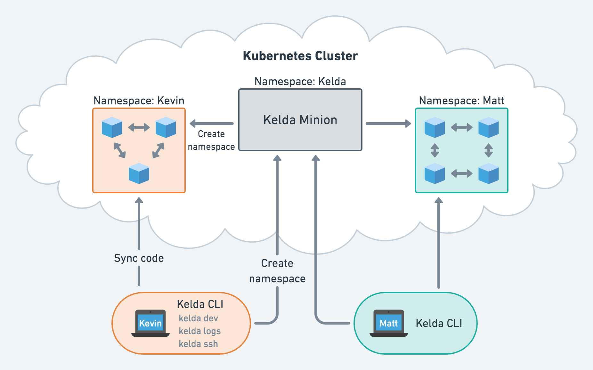

# Architecture

When you install Kelda for the first time, it sets up two components:

- The **Kelda Minion** runs in the Kubernetes cluster. It takes requests from
  the Kelda CLI and interacts with the Kubernetes API to create development
  namespaces, which run the containers required for development.
- The **Kelda CLI** is installed on developer workstations and is used to
  interact with their development environment. Developers use it to do things
  like creating the development environment, getting logs,
  and connecting via SSH.

Every developer needs the Kelda CLI installed on their workstation, but only
one instance of the Kelda Minion is required per cluster. If one developer
has already set up the minion, another developer only needs to
[install the CLI](../../installing-cli/) and connect to the cluster.

## **Components**

### The Kubernetes Cluster

The Kelda minion and all development namespaces run inside of a Kubernetes
cluster. Kelda is [compatible with clusters](../compatibility/) running both on
bare metal and cloud platforms such as
[Google Kubernetes Engine](https://cloud.google.com/kubernetes-engine/)
and [AWS Elastic Kubernetes Service](https://aws.amazon.com/eks/).

### The Kelda Minion

The Kelda Minion is installed into your Kubernetes cluster with
`kelda setup-minion`.  Please see the [deployment doc](../../deployment) for
more specific instructions.

The minion runs in the `kelda` namespace. After installing, you can run
`kubectl get pods -n kelda` to see the running minion pod:

	[kelda-demo]  ~/examples $ kubectl get pods -n kelda
	NAME                     READY   STATUS    RESTARTS   AGE
	kelda-55749f8bfb-k9cnw   1/1     Running   0          6d4h

#### Authentication

The minion and any ports opened by running services are not publicly
exposed.  The Kelda CLI communicates with the minion using a
[Kubernetes tunnel](https://kubernetes.io/docs/tasks/access-application-cluster/port-forward-access-application-cluster/), so developers only require
credentials to the cluster.

#### Required Permissions

The minion needs full access to the Kubernetes API to create namespaces
and deploy objects into them. The `kelda setup-minion` command automatically
handles configuring these permissions upon installation.

### The Development Namespace

Kelda uses
[Kubernetes namespaces](https://kubernetes.io/docs/concepts/overview/working-with-objects/namespaces/)
to separate developers from each other.

??? note "Kelda creates the namespace for you, you don’t need to create it yourself."
	Kelda runs `kubectl apply` to deploy the Kubernetes YAML in your
	[workspace config](../../configuring-kelda/workspace/overview/). If you need
	to reference global objects such as
	[`ClusterRole`](https://kubernetes.io/docs/reference/access-authn-authz/rbac/),
	you can apply them manually using
	[`kubectl apply`](https://kubernetes.io/docs/tasks/manage-kubernetes-objects/declarative-config/).

Once Kelda creates the namespaces for you, you can list
the resources in the namespace directly with `kubectl get pods -n <namespace>`.
The namespace is named per your
[user config](../../reference/configuration/#user-configuration).

For example, for the [Magda example application](../../experience-kelda),
the namespace resources look like this:

	[kelda-demo] /magda $ kubectl get pods -n matt
	NAME                                 READY   STATUS    RESTARTS   AGE
	authorization-api-b9578cd5d-6hbfd    1/1     Running   0          4m29s
	combined-db-0                        1/1     Running   0          4m26s
	content-api-7ccf48f468-vmhd5         1/1     Running   0          4m34s
	elasticsearch-0                      1/1     Running   0          4m26s
	gateway-7965679448-zsfb7             1/1     Running   0          4m33s
	indexer-b6fbb7878-hm8vb              1/1     Running   0          4m35s
	preview-map-799875fb87-xrgcp         1/1     Running   0          4m31s
	registry-api-full-5ff4554bf5-qvhvg   1/1     Running   0          4m32s
	search-api-779d79f75f-lqbbz          1/1     Running   0          4m35s
	web-6b9db6d586-jlnnf                 1/1     Running   0          4m33s

You can restart pods directly if necessary using
`kubectl delete pod -n <namespace> <pod name>`, however, we recommend instead
using Kelda to make changes.

### The Kelda CLI

The Kelda CLI is [installed locally](../../installing-cli) on the user's
workstation.

Upon launch with `kelda dev,` the CLI determines what Kubernetes cluster to
connect to based on the
[user config](../../reference/configuration/#user-configuration), which
references a Kubernetes cluster in your
[kubeconfig](https://kubernetes.io/docs/tasks/access-application-cluster/configure-access-multiple-clusters/).  It then creates your development namespace in the cluster.

The CLI then uses the
[workspace config](../../configuring-kelda/workspace/overview/) to determine
what should be deployed to the development namespace. Developers using different
namespaces can deploy different workspaces.

### Code Syncing

When you run a service in “development mode”, Kelda injects a process into the
container that handles code syncing. The Kelda CLI communicates with this
`dev-server` process to sync local files to the cluster. After each sync, the
`dev-server` restarts any processes defined in the sync config.

??? note "Kelda doesn’t restart the entire container, it just restarts the processes."

The following output shows the processes running in the Magda web-server service
while under development.

	# ps e
    PID TTY      STAT   TIME COMMAND
      1 ?        Ss     0:00 sh -c cp /bin-volume/kelda /tmp/kelda && /tmp/kelda dev-server web-server 0
      7 ?        Sl     0:00 /tmp/kelda dev-server web-server 0
     27 ?        Sl     0:00 node --inspect src/index.js --config /etc/config/config.json --listenPort 80 --baseExternalUrl http://minikube.data.gov.au:30100 --useLocalStyleSheet true --registryApiBaseUrlInternal http://registry-api/v0

|PID|Purpose|
|---|---|
|1|The command that injects the dev server|
|7|The dev server itself|
|27|The application command spawned by the dev-server. After each sync, Kelda kills the old instance of the command and reruns it.|

## **Fitting it all together**

Here's the complete picture of what happens when you run
`kelda dev magda-web-server`.

1. The Kelda CLI reads your
[workspace configuration](../../configuring-kelda/workspace/overview/) and
[sync configuration](../../configuring-kelda/sync/overview/).
1. The Kelda CLI sends a request to the Kelda minion to create a namespace based
on the workspace config.
1. The Kelda minion deploys the
[YAML](../../configuring-kelda/workspace/overview/#example-workspaceyaml) in the
workspace into the namespace, starting the specified Kubernetes deployments
and jobs.
1. The Kelda CLI creates tunnels to the services in the workspace configuration.
1. The Kelda CLI connects to the `dev-server` process to sync the local files over.
1. The `dev-server` starts the code once it’s synced.
1. Any changes to local code are synced and the `dev-server` process is restarted.
1. That’s it, you’re now ready to develop and test!
