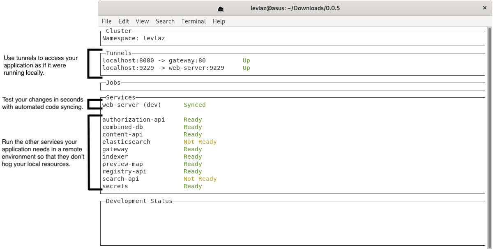

# CLI Reference

## dev

`kelda dev` creates and manages the development environment.

Specifically, it:

- Deploys the tunnels and services defined in the
  [workspace configuration](../configuration/#workspace-configuration).
- Syncs local changes to the services specified in the arguments.
- Displays a live status of all services and tunnels.



#### Usage

```
kelda dev [path to service] ...
```

## logs

`kelda logs` prints the logs for a service.

The service name should match the name in the `kelda dev` status page.

If multiple services are provided Kelda will show the logs of all of them.

#### Usage

```
kelda logs <service> ...
```

## ssh

`kelda ssh` gets a shell in a service.

The service name should match the name in the `kelda dev` status page.

#### Usage

```
kelda ssh <service>
```

## update

`kelda update` checks for updated versions of the Docker images in your
application according to the upstream Docker registry. If it finds newer
images, it restarts the out of date containers to bring them up to date with
the newest versions.

#### Usage

```
kelda update
```

## upgrade-cli

`kelda upgrade-cli` upgrades the local Kelda CLI binary to match the minion's
version. It also allows the CLI to be downgraded if the minion is at a lower
version.

#### Usage

```
kelda upgrade-cli
```

## delete

`kelda delete` deletes the development environment of the current namespace.

It does not affect any other development environments in the cluster, such as
those belonging to other developers.

#### Usage

```
kelda delete
```

## version

`kelda version` prints the versions of the CLI and the Kelda cluster components.

#### Usage

```
kelda version
```

## bug-tool

`kelda bug-tool` generates a debug archive that's helpful when reporting issues
to the Kelda team.

#### Usage

```
kelda bug-tool
```

## config

`kelda config` sets up the Kelda [user configuration](../configuration/#user-configuration)
in `~/.kelda.yaml`.

#### Usage

```
kelda config
```


## setup-minion

`kelda setup-minion` installs the Kelda cluster components into the Kubernetes
cluster.

#### Usage

```
kelda setup-minion
```
