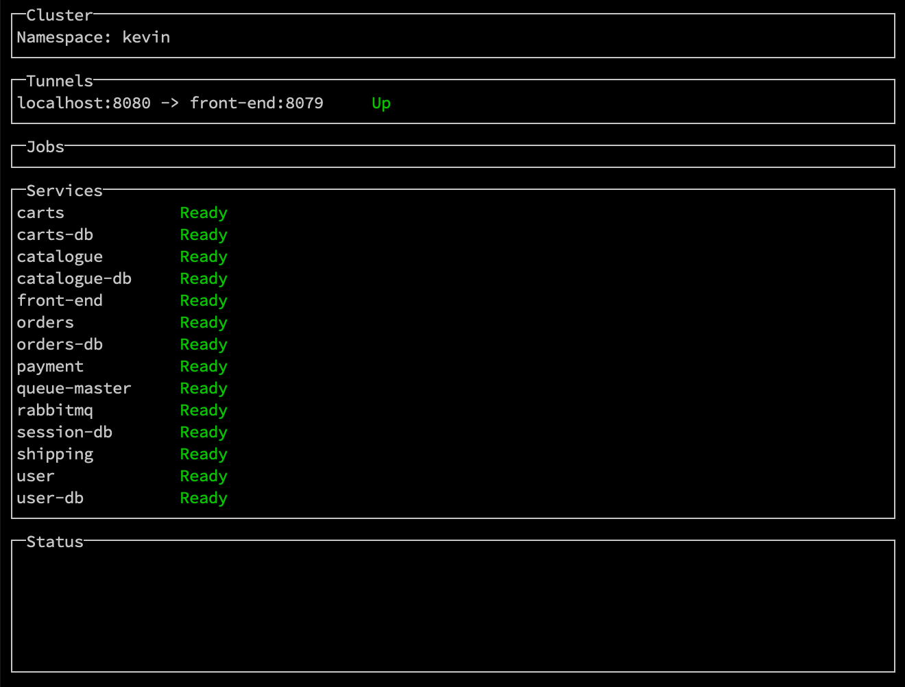
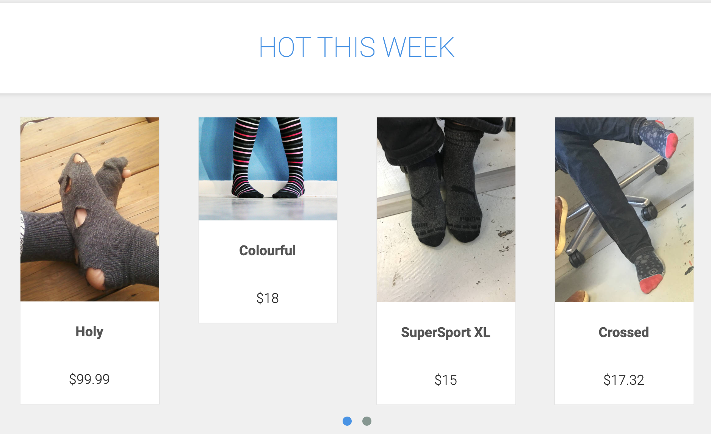
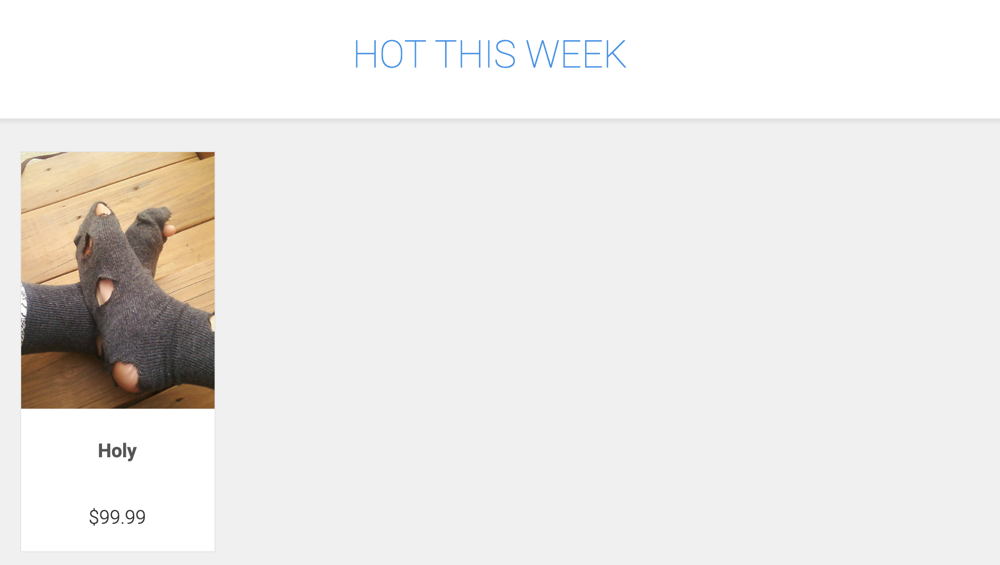

# Run Code Locally with Telepresence (Experimental)

**Estimated Time**: 10 minutes 
**Dependencies**:

* [Telepresence](https://www.telepresence.io/reference/install) (this guide was tested with **v0.102**)
* [Kubectl](https://kubernetes.io/docs/tasks/tools/install-kubectl/) (tested with **v1.15.2**)
* [Nodejs](https://nodejs.org/en/download/) (tested with **v10.15.3**)

By default, Kelda enables local development by syncing local files into the
Kubernetes cluster, and restarting the code after each sync.

[Telepresence](https://www.telepresence.io/) sets up a network proxy so that
local code seems like it's running within the Kubernetes cluster. The local
process can make requests to other services in the cluster, and services in the
cluster can make requests to the local code.

This guide shows how Telepresence can be used with Kelda. Kelda handles booting
all the dependencies in an easy to use development sandbox, while Telepresence
allows you to directly control how your development code is run.

## **Using Telepresence with Your Own Service**

To use Telepresence with your services, just boot your dependencies with `kelda
dev`, and use Telepresence to swap out the deployment that you'd like to
modify.

If you don't need to code sync any of your services, start Kelda with `kelda dev
--no-sync`.

Telepresence has multiple approaches to proxying, so check out [their
docs](https://www.telepresence.io/reference/methods) to see what's best for
you.

### Example

The Sock Shop example below uses the following Telepresence command.

    telepresence --context $(kelda config get-context) \
                 --namespace $(kelda config get-namespace) \
                 --expose 8079 \
                 --swap-deployment front-end \
                 --run npm start

| Flag            | Description |
| --------------- | ----------- |
| context         | The kubectl context that Telepresence uses to connect to the cluster. This must match the context used by Kelda. |
| namespace       | The namespace that Telepresence connects to. This must match the namespace used by Kelda. |
| expose          | The port to expose to the cluster. The frontend exposes 8079 because that's the port it listens on. |
| swap-deployment | The deployment to replace in the Kubernetes cluster. This deployment should be created by Kelda before it's replaced. |
| run             | The command to proxy. |

## **Try It Out**

To quickly experience what developing with Telepresence is like, we will make a
code change to the example Sock Shop application.

### **Install Kelda**

1. **[Install the Kelda CLI](../../installing-cli)**

    Run the following command to download and install Kelda.

        curl -fsSL 'https://kelda.io/install.sh' | sh

1. **Download the [Kelda examples repository](https://github.com/kelda-inc/examples)**

    This repository contains a script that we'll use to connect to the demo
    cluster, as well as the source code and Kelda config for Sock Shop.

        git clone https://github.com/kelda-inc/examples

1. **Configure Kelda to work on the Sock Shop project**

    The following command creates a file in your home directory that's required
    for the `kelda` commands to work.

    Most users can just use the defaults by hitting [Enter] for each prompt.

    In the root directory of the examples repository, run:

        ./golang-sock-shop/configure-kelda.sh --use-demo-cluster

    If the command succeeded, you should see something like:

        Wrote config to /Users/kevin/.kelda.yaml

    ??? tip "Kelda maintains a public cluster for demos. If you've already [setup a Kelda cluster](../../deployment), just omit the `--use-demo-cluster` flag."

### **Develop with Telepresence**

We're now ready to test a change to the Sock Shop frontend.

1. **Boot the Sock Shop services**

    Run the following command to boot the Sock Shop services in the Kubernetes
    cluster.

    The `--no-sync` flag is used to tell Kelda that nothing should be run in
    development mode. Telepresence will handle swapping out the frontend
    service because we use the `--swap-deployment` flag.

        kelda dev --no-sync

    Wait for of all the services to become `Ready`. The first run may take
    several minutes while all the services boot.

    {:height="450px"}

1. **Start the Sock Shop Front End via Telepresence**

    ??? note "You must [install](https://www.telepresence.io/reference/install) the Telepresence CLI before continuing."

    Run the following commands in a new terminal. Telepresence will swap out the
    `front-end` deployment created in step (2) with the network proxy, and run
    the `node server.js` command locally.

        source use-demo-cluster.sh
        cd golang-sock-shop/front-end
        telepresence --context $(kelda config get-context) --namespace $(kelda config get-namespace) --expose 8079 --swap-deployment front-end --run npm start

    You should see something like

        T: Setup complete. Launching your command.
        Using the redis based session manager
        App now running in development mode on port 8079

    ??? tip "If you get an error about 'package.json' not existing.."

        You're likely running Telepresence from the wrong directory.

        Make sure that you're running Telepresence from the
        `golang-sock-shop/front-end` directory.

1. **View the Sock Shop homepage**

    Once the `kelda dev` UI shows that the tunnel is "Up", open
    [http://localhost:8080](http://localhost:8080) in your browser. This
    usually takes around 30 seconds.

    There should be various socks with prices at the bottom of the page.

    ??? tip "If the page looks like it's only partially loaded, Telepresence's DNS resolution may be broken."

        See [below](#dns-resolution-failures) for more information.

    

    When you access `localhost:8080`, Telepresence proxies the request to
    your local instance of the frontend. The local node server also makes
    requests to the `catalogue` service running in the cluster.

1. **Change the number of socks on the homepage**

    Uncomment line 187 of `golang-sock-shop/front-end/public/index.html` so
    that `numResults` is set to 1.

    The Node service run by Telepresence will serve the updated `index.html`
    when the homepage is reloaded.

1. **View the change in your browser**

    Reload [http://localhost:8080](http://localhost:8080). There should now
    only be one item under "Hot This Week".

    

### **Cleanup**

1. **Exit Telepresence**

    Exit Telepresence by entering `Ctrl + c` into the terminal window where
    Telepresence is running.

1. **Exit Kelda**

    Exit Kelda by entering `Ctrl + c` into the terminal window where the Kelda
    CLI is running.

1. **Delete your development namespace**

    Run `kelda delete` to delete your development namespace so that it stops
    consuming resources in the remote cluster.

## **Limitations**

The Telepresence integration with Kelda is still experimental. We're continuing to
improve the experience of using Kelda with Telepresence.

### **DNS Resolution Failures**

Telepresence has an
[issue](https://github.com/telepresenceio/telepresence/issues/560) where DNS
resolution occasionally fails on Mac.

If this happens during the Sock Shop demo, the front end server logs will show
that requests to `/catalogue` and `/cart` are returning `500`, rather than
`200`.

[Flushing the DNS
cache](https://github.com/telepresenceio/telepresence/issues/560#issuecomment-484476698)
fixes this issue temporarily.

### **Multiple Telepresence Deployments**

Telepresence doesn't always remove the deployment it created for proxying.

If this happens, recreate the development environment with `kelda delete`, or
manually delete the deployment with `kubectl delete deployment <deployment
name>`.

### **Modifying Kubernetes Manifests While Running Telepresence**

Changing the Kubernetes manifests for a service being proxied by Telepresence
will wipe out the active Telepresence session. If this happens, you should
Ctrl-C the Telepresence process, and start it again.
