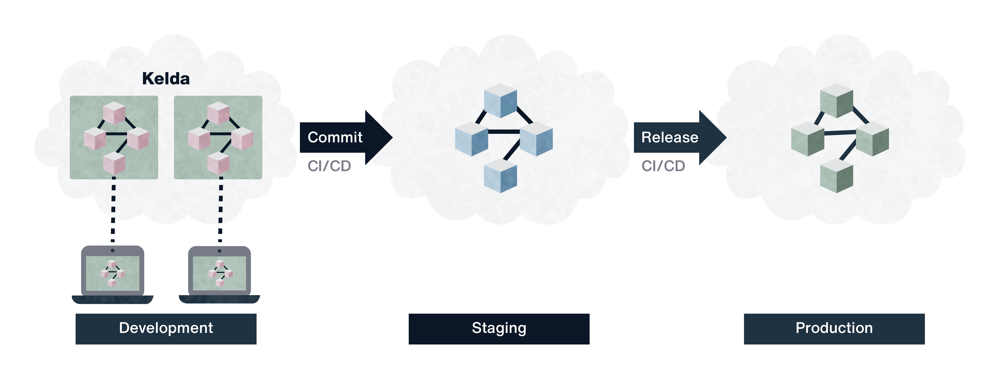

# What Is Kelda: FAQ

Kelda is a development environment for Kubernetes. It's a drop in replacement
for Docker Compose that allows you to quickly test your code in a remote
environment that matches production, without the complexity of interacting with
Kubernetes directly.

---

## **How does it work?**

The **Kelda CLI** (which runs on your laptop) handles code syncing and setting
up tunnels.

The CLI talks to an **operator** running in your Kubernetes cluster, which
creates a development namespace for you containing all your services.

Check out our [architecture documentation](../reference/architecture) for more
information.

---

## **What's the development workflow?**

1. **Run `kelda dev <service>` to start working on a service.**

    Kelda will start code syncing for the service, and boot the production
    versions of all the other services.

1. **Edit your code locally.**

    Kelda works with any editor -- it watches for file changes at the
    filesystem level.

    Once Kelda notices a file change, Kelda automatically syncs the new file
    over, and restarts the remote process.

1. **Test your code using tunnels.**

    Tunnels connect the ports on your local machine to the services in your
    development environment. These tunnels can be used with everything from
    your browser, to Postman, to your database client.

1. **If necessary, debug.**

    Kelda makes it easy to find all the information you need to quickly debug
    your code.

    To | Use
    -|-
    Get logs | `kelda logs <service>`
    Get a shell in a container | `kelda ssh <service>`
    Debug Kubernetes issues | `kubectl` directly

    For more advanced debugging, you can hook up your [language's
    debugger](https://strongloop.com/strongblog/interactive-debugging-with-node-js/),
    or use [Telepresence](../tutorials/telepresence) to run your service
    locally.

To learn more, try Kelda out yourself with an [example
application](../experience-kelda) on our demo cluster, or watch a video of
Kelda in action.

<iframe width="700" height="394" src="https://www.youtube.com/embed/cSRUTSBiIPY" frameborder="0" allow="accelerometer; autoplay; encrypted-media; gyroscope; picture-in-picture" allowfullscreen></iframe>

---

## **What configuration does it need?**

To use Kelda, you have to tell it how to boot your services. Kelda just needs
the **Kubernetes YAML** that you would use in production.

Kelda also requires a configuration file per service to enable **file syncing**
when you're developing on that service.

Check out our [configuration guide](../configuring-kelda/overview) to learn
more.

---

## **Why Kelda?**

You might like Kelda if...

* Your laptop is slow because it doesn't have enough CPU and RAM to run all
  your services.
* You're using Kubernetes in production and would like your development
  environment to run on Kubernetes as well.
* You don't want to deal with `kubectl` during development.  Testing your code
  takes too long because you have to wait for Docker to do a full image build
  and push.

---

## ** How is Kelda different than Minikube?**

Minikube, k3s, and Docker for Mac all provide a local instance of Kubernetes,
but don’t directly address the development workflow.

If you’re using one of these tools for local development, you have to manually
boot your services, and interact directly with them via `kubectl`.  Plus,
deploying changes by building and pushing images is very slow.

Kelda is compatible with all of these Kubernetes offerings if you’d like to run
your [Kubernetes
cluster locally](../deployment/creating-cluster/#run-the-cluster-locally), but
automate the workflow with Kelda.

---

## **How is Kelda different than Docker Compose?**

Kelda runs your services remotely, making your laptop much faster. In contrast,
Docker Compose runs everything on your local machine.

Plus, with Kelda, both your development environment and production environment
run on Kubernetes, leaving little room for error and bugs to enter your staging
environment. While Docker Compose requires maintaining two completely different
sets of configurations.

---

## **How is Kelda different than Skaffold?**

Skaffold is for developers that prefer to work directly with Kubernetes (via
`kubectl`). While `kubectl` has a lot of power, most of it isn't necessary
during development, and it requires deep Kubernetes knowledge to
leverage it.

For example, Kelda has a UI that shows the status of all your microservices,
while with Skaffold you have to piece together what’s going on with commands
like `kubectl get pods` and `kubectl get deployments`.

---

## **How is Kelda different than Telepresence?**

Kelda can work in conjunction with Telepresence. Telepresence solves the
specific problem of proxying local code to a remote cluster, while Kelda also
boots your dependencies, and provides a simple interface to Kubernetes.

We have an example of a [Kelda Telepresence
integration](../tutorials/telepresence).

---

## **How does code syncing work for compiled languages?**

We recommend compiling locally, then syncing the resulting binary into the
container.

---

## **What security permissions does it need?**

Kelda doesn’t open any public ports. The only ports it opens is on `localhost`
for tunnels.

The Kelda CLI communicates directly with the Kubernetes API server to create
[tunnels](https://kubernetes.io/docs/tasks/access-application-cluster/port-forward-access-application-cluster/),
communicate with the Kelda Operator, and get logs.

Authentication with the API server is handled by the standard [Kubernetes
methods](https://kubernetes.io/docs/concepts/configuration/organize-cluster-access-kubeconfig/).

---

## **How much does Kelda cost?**

Kelda is free for individual developers, and everything you need to get started
is in the docs. If you’re a team looking to adopt Kelda, [get in
touch](/contact) with us to discuss plans.

---

## **How does Kelda fit into my CI/CD pipeline and other environments?**

Kelda focuses on the development workflow that comes before you make a PR. Once
you commit your code, your existing CI/CD pipeline should take over. Using
Kelda doesn’t require you to change your CI/CD pipeline or production
infrastructure at all.

---

## **How do I create a Kubernetes cluster to run Kelda?**

We recommend using [Hosted Kelda](/request-hosted-kelda-access/) so that you
don’t have to deal with creating and maintaining a Kubernetes cluster.

Kelda also works alongside non-Kelda services, so if you already have a staging
cluster, you can just deploy Kelda there.

For a list of all the options see our [Kubernetes deployment
guide](../deployment).

---

## **How does Kelda integrate with my IDE?**

Kelda works at the file system level, so it will sync code changes regardless
of what IDE you used to make them.

For debuggers, just create a [Kelda
tunnel](../reference/configuration/#tunnels-optional) to the debugger port,
and point your IDE at the tunnel.

---

## **Does Kelda work with templating tools like Kustomize and Helm?**

Yes, Kelda supports [deploying the output of a
script](../configuring-kelda/workspace/templating-tools). So you can install
Kustomize locally, and reference the `kustomize build` command in your
`workspace.yaml`.

We also have first class support for some tools, like [Helm](../configuring-kelda/workspace/helm).

---

## **Couldn’t find what you’re looking for?**

Try our docs search, or join the [Kelda
Slack](https://app.slack.com/client/T4LADFWP5).

---

## **Ready to try it?**

Try out our [example application](../experience-kelda) on our demo cluster to
experience Kelda yourself.

Then, once you're ready to setup Kelda for your application, check out our
[Quickstart](../quickstart).
